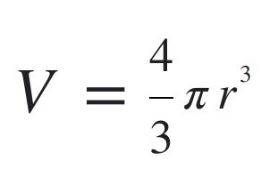

# Sphere volume

## Objekt koule
Vytvořte třídu (`class` nebo `record`) `Sphere` (nový soubor [Sphere.java](src/main/Sphere.java)) ve složce [src/main](src/main/),
která bude reprezentovat kouli.

Třída `Sphere` bude mít jeden povinný atribut `radius` typu `int`.\
Třída `Sphere` bude mít metodu `getVolume()`, která vráti objem koule.\
Vytvořte třídu `Main` s funkcí `main`, ve které vytvoříte jeden objekt `Sphere` a vytisknete její objem.

## Test
Pro otestovaní objektu `Sphere` spusti: [SphereTest.java](src/test/SphereTest.java)

## Cheat sheet
Vzorec pro výpočet objemu koule:

